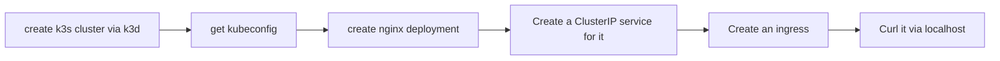

## create k3s cluster via k3d 
```bash
k3d cluster create mytest

## or expose service https://k3d.io/v5.6.0/usage/exposing_services/
k3d cluster create --api-port 6550 -p "8081:80@loadbalancer" --agents 2
```


## install kubernetes dashboard
```bash
kubectl apply -f https://raw.githubusercontent.com/kubernetes/dashboard/v2.7.0/aio/deploy/recommended.yaml

## or 
kubectl apply -f https://raw.githubusercontent.com/kubernetes/dashboard/v2.7.0/aio/deploy/alternative.yaml

## self modified version base one above 
curl https://raw.githubusercontent.com/leson/guides/master/k8s/k3d/dashboard/alternative.yaml
curl https://raw.githubusercontent.com/leson/guides/master/k8s/k3d/dashboard/admin-rbac.yaml

kubectl apply -f alternative.yaml
kubectl apply -f admin-rbac.yaml
```

## obtain token of admin-user
```bash
kubectl -n kubernetes-dashboard describe secret $(kubectl -n kubernetes-dashboard get secret | grep admin-user | awk '{print $1}')

```

## testing dashboard connectivity 
```bash
https://localhost:30000/#/login
```