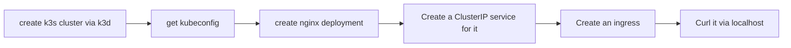

## create k3s cluster via k3d 
```bash
k3d cluster create mytest

## or expose service https://k3d.io/v5.6.0/usage/exposing_services/
k3d cluster create --api-port 6550 -p "8081:80@loadbalancer" --agents 2
```



## install kubernetes dashboard
```bash
kubectl apply -f https://raw.githubusercontent.com/kubernetes/dashboard/v2.7.0/aio/deploy/recommended.yaml

## or 
kubectl apply -f https://raw.githubusercontent.com/kubernetes/dashboard/v2.7.0/aio/deploy/alternative.yaml

```
