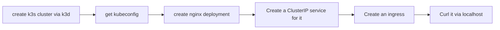

## create k3s cluster via k3d 
```bash
k3d cluster create mytest

## or expose service https://k3d.io/v5.6.0/usage/exposing_services/
k3d cluster create --api-port 6550 -p "8081:80@loadbalancer" --agents 2
```


## install kubernetes dashboard
```bash
kubectl apply -f https://raw.githubusercontent.com/kubernetes/dashboard/v2.7.0/aio/deploy/recommended.yaml

## or 
kubectl apply -f https://raw.githubusercontent.com/kubernetes/dashboard/v2.7.0/aio/deploy/alternative.yaml

## self modified version base one above 
curl https://raw.githubusercontent.com/leson/guides/master/k8s/k3d/dashboard/recommended.yaml -o recommended.yaml
curl https://raw.githubusercontent.com/leson/guides/master/k8s/k3d/dashboard/alternative.yaml -o alternative.yaml


kubectl apply -f recommended.yaml
# kubectl apply -f alternative.yaml

# kubectl delete -f alternative.yaml
# kubectl delete -f admin-rbac.yaml
```

## create dashboard certs
```bash
#************   创建证书   ************  
mkdir dashboard-certs
cd dashboard-certs/

# 创建命名空间
kubectl create namespace kubernetes-dashboard

# 创建key文件
openssl genrsa -out dashboard.key 2048

# 证书请求
openssl req -days 36000 -new -out dashboard.csr -key dashboard.key -subj '/CN=leson.com'

# 自签证书
openssl x509 -req -in dashboard.csr -signkey dashboard.key -out dashboard.crt

# 创建kubernetes-dashboard-certs对象
kubectl create secret generic kubernetes-dashboard-certs --from-file=dashboard.key --from-file=dashboard.crt -n kubernetes-dashboard
## kubectl delete secret kubernetes-dashboard-certs -n kubernetes-dashboard

# 安装kubernetes-dashboard
cd ../
kubectl create -f alternative.yaml
# 注: 这是因为我们在创建证书时，已经创建了kubernetes-dashboard命名空间，如果有命名空间已存在的报错，直接忽略即可。

```

## obtain token of service account
| refer to https://github.com/kubernetes/dashboard/blob/master/docs/user/access-control/creating-sample-user.md
```bash
# kubectl -n kubernetes-dashboard create token admin-user
curl https://raw.githubusercontent.com/leson/guides/master/k8s/k3d/dashboard/admin-rbac.yaml -o admin-rbac.yaml
kubectl apply -f admin-rbac.yaml 

kubectl get secret admin-user -n kubernetes-dashboard -o jsonpath={".data.token"} | base64 -d

```

## apply ingress
```bash
curl https://raw.githubusercontent.com/leson/guides/master/k8s/k3d/dashboard/ingress.yaml -o ingress.yaml

kubectl apply -f ingress.yaml
# kubectl delete -f ingress.yaml
```

## testing dashboard connectivity 
```bash
# nohup kubectl proxy &
# ssh -L localhost:8001:localhost:8001 -NT user@YOUR_IP
# http://YOUR_IP:8001/api/v1/namespaces/kubernetes-dashboard/services/https:kubernetes-dashboard:/proxy/


curl -kv http://localhost:30000/#/login

```